# DNS or how to give aname to an IP
# Presentation
###### CISSOKHO Issiaka PASCAL Arthur
Here is a little presentation from both of us.
We are both students from the IT departement of the IUT of Bordeaux. 
Issiaka did his first year of study in Montpellier and Arthur in Bordeaux. We are both interested in computer science, technologies, and we are proudly involved in our studies. 
Apart from school, Issiaka taught his cat to pee in the toilet meanwhile Arthur broke his arm while trying to impress his grandma.

## Getting started

### IP and name configuration
To begin with, we have to configurate client 1, client2, DNS1 and DNS2 to allow them to have IP addresses from the DHCP server on root. 
For that, we have to write on etc/network/interface file the following line :

>iface eth0 inet dhcp

The virtual machines have these IPs :

>**Client1**: 192.168.0.10

>**Client2**: 192.168.0.20

>**dns1**: 192.168.0.1

>**dns2**: 192.168.0.2

Here's an extract of the routing table : 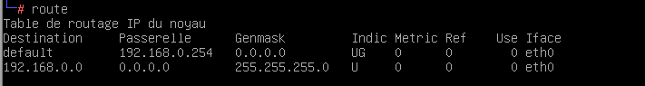

The gateway's IP has the address 192.168.0.254
### Dns client configuration
The next step would be to set up the **etc/hosts** file of dns1 to give a name to the IP adresses associated with the machines. 

<blockquote>192.168.0.10   client1 
192.168.0.20   client2
192.168.0.2    dns2
</blockquote>
 
We can see on the **resolv.conf** file that the nameserver IP is 172.16.0.3. 
This IP is given by the DHCP server **root**.

Edit the **/etc/dhcp/dhclient.conf** file with for the DNS machine:

>supersede domain-name-servers 127.0.0.1;

and also for clients :

>supersede domain-name-servers < ip of the DNS server associated >

When the commands <em>ifdown</em> and <em>ifdown</em> are typed in for the **interface eth0** on any client, the resolv.conf file changes :

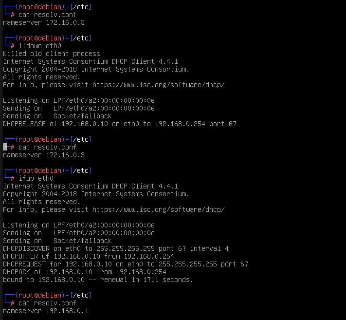

Next you should edit the **/etc/bind/named.conf.options** on dns1 and dns2 to **allow external DNS requests**.

## DNS servers configuration
### Primary server configuration
First of all, edit the **/etc/bind/named.conf.local** file with 
<blockquote>
zone "netas"{    

type master;

file "/etc/bind/db.netas";

};
</blockquote>

Including this piece of code into the file will grant dns1 to be in charge of the main domain "netas".

We then have to copy the the /etc/bind/db.empty file in /etc/bind/db.netas

After that, we can we have to update the /etc/bind/db.netas file with this entry :

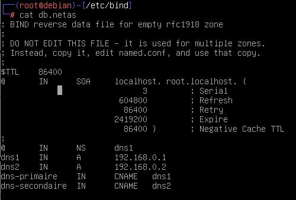

So, now we have the aliases for the dns1 and dns2 machine with this names and dns-primaire, dns-secondaire name too

Don't forget to update the serial number

We can see the changes by realoading or restarting the dns and now we can ping from client1 and client2 as we can see :

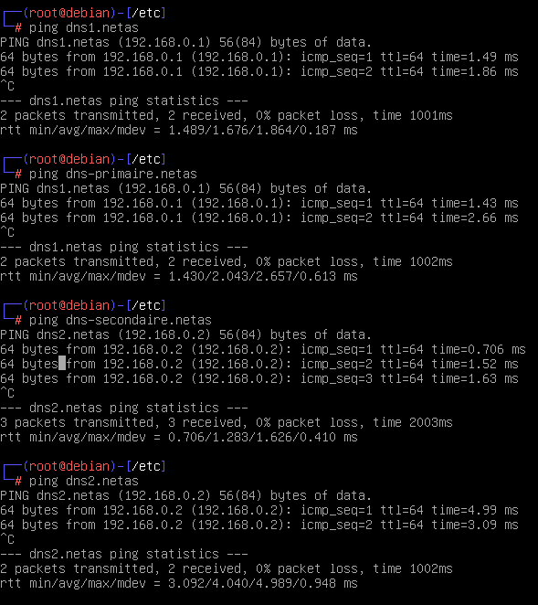

### Secondary configuration 
Now we edit the /etc/bind/named.conf.local on the dns2 to declare the netas zone as secondary from the server dns1.

Now we can see that all works well with the command "host" from client2 :

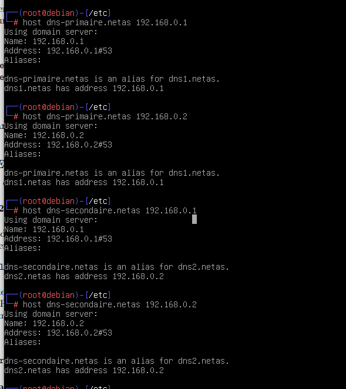

### Lan server study
The mask /22 means that there are 1024 addresses possible and have the subnet mask 255.255.252.0

We scan all the machines from the LAN SERVER network and find these IP :

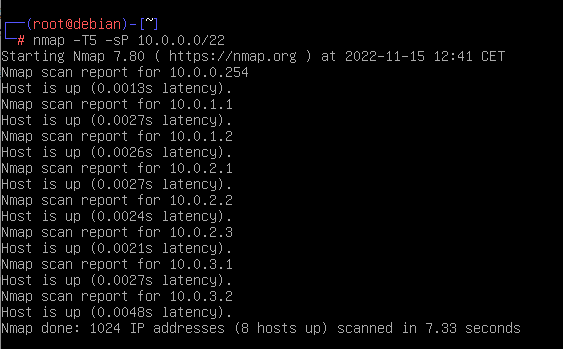

We can find the following correspondance between the IP address and the name of the machine :

<blockquote>
10.0.1.1 : a1,
10.0.1.2 : a2,
10.0.2.1 : s1,
10.0.2.2 : s2,
10.0.2.3 : s3,
10.0.3.1 : p1,
10.0.3.2 : p2

### Reverse zone configuration
</blockquote>
We need now to create the reverse DNS zone to allow us to go from the IP to the name. For that we have to write this :

<blockquote>
zone "2.0.10.in-addr.arpa" {

type master;

file "/etc/bind/db.netas-rev";

};
</blockquote>

We can see it works by the command "host < IP of the machine >

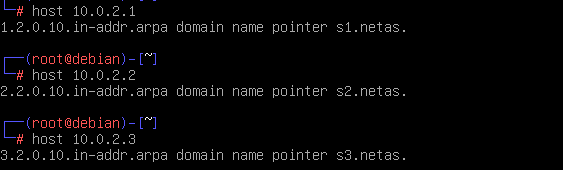

### Subdomain configuration
We must now add a new subdomain in /etc/bind/named.conf.local for the zone "perf.netas". We add also the configuration file associated as db.perf.netas.

We need to make dns2 a secondary server of perf.netas on dns1 : edit the named.conf.local on dns2 as following 

Then we can try to test the speed of rate on client1 and client2 simultanously as we can see here :

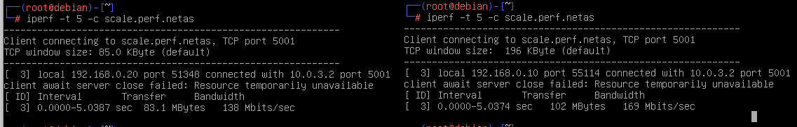

We have now to do the reverse zone of the scale.perf.netas. To do that we have to edit the /etc/bind/db.perf.netas-rev as following : 

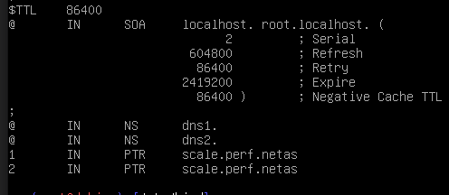

Now we can host p1.netas and p2.netas and see their addresses are 10.0.3.1 and 10.0.3.2

### Configuration of a new sub-domain

We have now to do a new sub-domain for a1 and a2 which have administration website.

To do that we have to repeat the process like we did for p1 and p2.

We edit the /etc/bind/named.conf.local in dns1 to add the zone "admin.netas"

Then we added the "slave" zone in dns2

Then we created the /etc/bind/db.admin.netas file on dns1 which has the IP addresses of the a1 and a2 machines and then we can ping on client1 and client2 as we can see here :

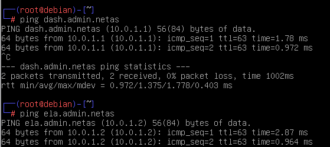
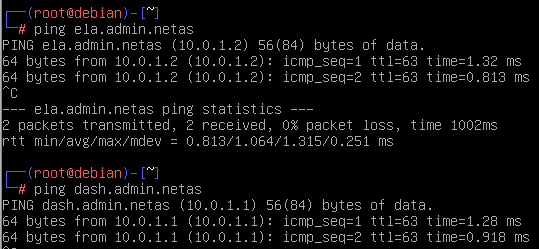

## Setting up a DNS cache poisoning attack

To begin this attack we have to create a file with a corresponding IP address from 192.168.0.42. We decided to choose google.fr.

Then we launch the client2 machine with a virtual desktop with startx command to begin the arp Spoofing command with arpspoof. This command take for first argument the IP address of the victim and then the real gateway (dns1).
> arpspoof - t 192.168.0.10 192.168.0.1

We now add the dnsspoof command with paramater the interface and then the file we created before.

> dnsspoof -i eth0 -f /etc/filePirate

Now if we try to access google.fr the site is replaced by the site on 192.168.0.42 as we can see :

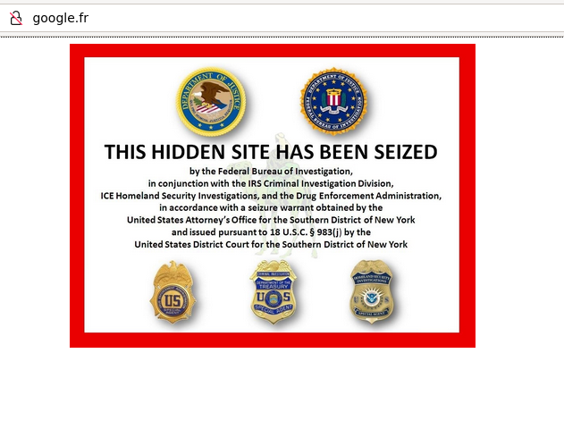
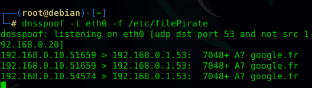

### Portfolio

We are going to do a feedback of this project with some picture of our configurations files and some explanation of what works were expected and how we managed to do it. For example we can say that we install two dns servers and deploy it on a network with some machines. We created three zones and subdomains and their reverse zone. We had three weeks to do it and we worked a lot on the two firsts so we finished in time.