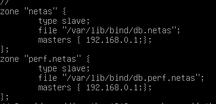

# DNS or how to give aname to an IP
# Presentation
###### CISSOKHO Issiaka PASCAL Arthur
Here is a little presentation from both of us.
We are both students from the IT departement of the IUT of Bordeaux. 
Issiaka did his first year of study in Montpellier and Arthur in Bordeaux. We are both interested in computer science, technologies, and we are proudly involved in our studies. 
Apart from school, Issiaka taught his cat to pee in the toilet meanwhile Arthur broke his arm while trying to impress his grandma.

## Getting started

### IP and name configuration
To begin with, we have to configurate client 1, client2, DNS1 and DNS2 to allow them to have IP addresses from the DHCP server on root. 
For that, we have to write on etc/network/interface file the following line :

>iface eth0 inet dhcp

The virtual machines have these IPs :

>**Client1**: 192.168.0.10

>**Client2**: 192.168.0.20

>**dns1**: 192.168.0.1

>**dns2**: 192.168.0.2

Here's an extract of the routing table : 

The gateway's IP has the address 192.168.0.254
### Dns client configuration
The next step would be to set up the ***etc/hosts*** file of dns1 to give a name to the IP adresses associated with the machines. 

<blockquote>192.168.0.10   client1 
192.168.0.20   client2
192.168.0.2    dns2
</blockquote>
 
We can see on the **resolv.conf** file that the nameserver IP is 172.16.0.3. 
This IP is given by the DHCP server **root**.

Edit the ***/etc/dhcp/dhclient.conf*** file with for the DNS machine:

>supersede domain-name-servers 127.0.0.1;

and also for clients :

>supersede domain-name-servers < ip of the DNS server associated >

When the commands <em>ifdown</em> and <em>ifdown</em> are typed in for the **interface eth0** on any client, the resolv.conf file changes :

Next you should edit the ***/etc/bind/named.conf.options*** on dns1 and dns2 to **allow external DNS requests**.

## DNS servers configuration
### Primary server configuration
First of all, edit the ***/etc/bind/named.conf.local*** file with 
<blockquote>
zone "netas"{    

type master;

file "/etc/bind/db.netas";

};
</blockquote>

Including this piece of code into the file will grant dns1 to be in charge of the main domain **netas**.

We then have to copy the the /etc/bind/db.empty file in /etc/bind/db.netas

After that, we can update the /etc/bind/db.netas file with this entry :

The next step would be to add the aliases for **dns1**, **dns2** and to add <em>dns-primaire</em> and <em>dns-secondaire</em> respectively to **dns1** and **dns2**.

**It is important to not forget to update the serial number every time you edit this file !**

We can see the changes by reloading or restarting the dns.
It's now possible to ping ***dn1.netas***, ***dns2.netas,*** ***dns-primaire.netas*** and ***dns-secondaire.netas*** from **client1** and **client2** :

### Secondary configuration 
Edit ***/etc/bind/named.conf.local*** on **dns2** to declare the netas zone as secondary from the server **dns1**.

Make sure everything's working correctly with the command "host" from client2 :

### Lan server study
Mask /22 means that there are 1024 addresses possible and they all have the subnet mask 255.255.252.0

We scan with **nmap** all the machines from the LAN SERVER network and find these IP :

We can find the following correspondance between the IP address and the name of the machine :

<blockquote>
10.0.1.1 : a1,
10.0.1.2 : a2,
10.0.2.1 : s1,
10.0.2.2 : s2,
10.0.2.3 : s3,
10.0.3.1 : p1,
10.0.3.2 : p2
</blockquote>

### Reverse zone configuration
We need to create the reverse DNS zone to allow us to go from the IP address to the name. 
For that we have to type this :

<blockquote>
zone "2.0.10.in-addr.arpa" {

type master;

file "/etc/bind/db.netas-rev";

};
</blockquote>

We can see it working by the command **host < IP of the machine >**

### Subdomain configuration
We must now add a new subdomain in ***/etc/bind/named.conf.local*** for the zone **perf.netas**. We also add the configuration file associated as **db.perf.netas**.

We need to make **dns2** a secondary server of **perf.netas** on **dns1** : edit the ***named.conf.local*** on **dns2** as following : 

Then we test the rate speed on **client1** and **client2** simultanously as we can see here :

Now we have to configure the reverse zone of the scale.perf.netas. To do that, we have to edit the ***/etc/bind/db.perf.netas-rev*** : 

Now we can host **p1.netas** and **p2.netas** and see their addresses are 10.0.3.1 and 10.0.3.2

### Configuration of a new sub-domain

We now create a new sub-domain for **a1** and **a2** which have administration website.

Repeat the process like we did before for **p1** and **p2**.

We edit once gain ***/etc/bind/named.conf.local*** in **dns1** to add the zone **admin.netas**

Then we added the **slave** zone in dns2

Create ***/etc/bind/db.admin.netas*** on **dns1** which will have the IP addresses of **a1** and **a2**.
At that point we can ping on **client1** and **client2** as we can see here :

## Setting up a DNS cache poisoning attack

To begin this attack, create a file with an IP address from **192.168.0.42** and a **domain name**. We decided to choose **google.fr**.

Then we launch **client2**'s graphical interface with **startx** to begin the ARP Spoofing with **arpspoof**. This command take for first argument the **IP address** of the victim and then the **real gateway** (here **dns1**).
> arpspoof - t 192.168.0.10 192.168.0.1

We now add the **dnsspoof** command, with first the interface **eth0** and then **the file we just created** :

> dnsspoof -i eth0 -f /etc/filePirate

If we try to access **google.fr**, the website is replaced by the website located on 192.168.0.42 :

### Portfolio

We are going to do a feedback of this project with some picture of our configurations files and some explanations of how it functions, what was expected and how we managed to do it. 
To give a quick example, we installed two DNS servers and deployed them on a network loaded with virtual machines. We created three zones and subdomains and their reverse zone. 
We had three weeks to do it and we put in a lot of work right at the start. The job was done quite rapidly, but it took us some time to fix problems.